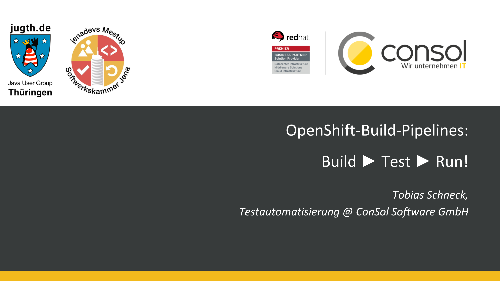
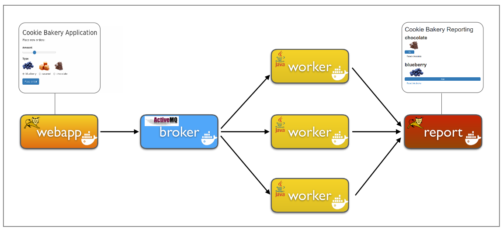
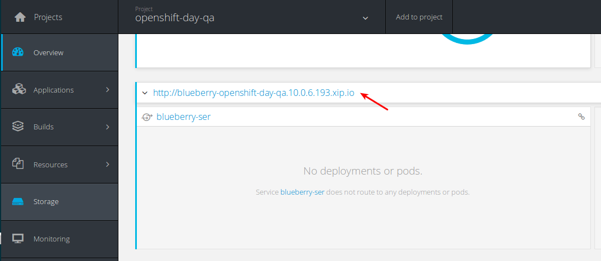

# Automated CI/CD Build Pipeline with Jenkis in OpenShift

The GitHub repository [toschneck/openshift-example-bakery-ci-pipeline](https://github.com/toschneck/openshift-example-bakery-ci-pipeline) contains, the sourcecode for the examples of the talk **[Continuous Testing: Integration- und UI-Testing mit OpenShift-Build-Pipelines](https://www.slideshare.net/TobiasSchneck/continuous-testing-integration-und-uitesting-mit-openshiftbuildpipelines)** at the Redhat/ConSol OpenShift-Day:

[](https://www.slideshare.net/TobiasSchneck/continuous-testing-integration-und-uitesting-mit-openshiftbuildpipelines)


The example shows, how we can setup up total automated build pipeline with following components:

* [OpenShift Build Pipelines](https://docs.openshift.com/container-platform/3.5/install_config/configuring_pipeline_execution.html) 
* [Jenkinsfile](https://jenkins.io/doc/book/pipeline/jenkinsfile/)
* [Docker](https://www.docker.com/)
* [Maven](http://maven.apache.org/)
* [Citrus](https://github.com/christophd/citrus)
* [Sakuli](https://github.com/ConSol/sakuli)

## Demo Web Application "Backery"

The cookie bakery demo sample application uses a multi module Maven project with each module being deployed in a separate
Docker container. The modules are:

* web
* worker
* report



The final application will uses some Docker images, which will be loaded from DockerHub repository for Java, Tomcat, ActiveMQ and so on. After the startup, the application will have the following Docker containers:

```
* bakery-web-server
* report-server
* activemq-server
* worker-chocolate
* worker-blueberry
* worker-caramel
```

## Create the OpenShift infrastructure

First you have to login at your running openshift, like this:

    oc login -u developer -p developer --insecure-skip-tls-verify=true https://MYHOST:8443
    
If you doesn't have an existing installation use [MiniShift](https://github.com/minishift/minishift) or create a local cluster with the command:

    mkdir -p $OSENV
    echo "create oc cluster for $OSENV"
    oc cluster up \
    	 --use-existing-config \
    	 --host-config-dir=$OSENV/config \
    	--host-data-dir=$OSENV/data \
    	--host-pv-dir=$OSENV/vol \
    	--public-hostname=$(hostname)

### Deploy Nexus Registry

First of all we need a working Nexus registry, where we can deploy our maven artifacts and cache some dependency packages. If you doesn't have one, you can create on be the following commands directly in our OpenShift cluster:

    oc new-project ta-nexus
    openshift/infrastructur/nexus/create-nexus.sh
    
After the deployment is successful you will get a new Nexus. Please note the URL how you can access it. On my local OpenShift cluster it is: `nexus-ta-nexus.10.0.6.193.xip.io`
     
 
### Create Project Infrastructure and Jenkins Server
Before you deploy the whole infrastructure we need to configure the following environment variables:

**1) `NEXUS_HOST`:**

Use the hostname of te nexus repository you wan't to use. In the example above it is `nexus-ta-nexus.10.0.100.201.xip.io`, so execute:
    
    oc describe route nexus | grep -i request
    Requested Host:		nexus-ta-nexus.10.0.6.193.xip.io
    
    export NEXUS_HOST=nexus-ta-nexus.10.0.6.193.xip.io
        
**2) `IMAGE_REG`:**
As long as OpenShift can only use ImageStream names in DeploymentConfigs and not at normal POD definitions, we have specify the internal used image registry:

    oc get is
    NAME      DOCKER REPO                   TAGS      UPDATED
    nexus     172.30.1.1:5000/nexus/nexus   2.14.4    5 minutes ago
    
    export IMAGE_REG=172.30.1.1:5000

Now execute the script [`openshift/create-openshift-pipeline-infrastructur.sh`](openshift/create-openshift-pipeline-infrastructur.sh) and the following openshift objects will created:

* One project for each stage: `ta-pipeline-dev`, `ta-pipeline-qa`, `ta-pipeline-prod`
* Service-Accounts `cd-agent`, `jenkins` to be able to trigger deployments in all stages 
* Jenkins Server 

***[OpenShift Build Pipeline - Part 01 - Build up Infrastructure (Nexus, Stages, Jenkins)](https://www.youtube.com/watch?v=rEye-wXsiA8)***
[](https://www.youtube.com/watch?v=rEye-wXsiA8)


## Create DEV Build Pipeline


Now it is time create our first Jenkins Pipeline, so execute:

    openshift/create-build-pipeline.sh dev
    
This script will use the build config stored in [`openshift/build.pipeline.yml`](openshift/build.pipeline.yml), [`jenkins/Jenkinsfile.dev`](jenkins/Jenkinsfile.dev) to start a new CI/CD pipeline with the following components:

* Maven build with Unit-Tests and WAR/JAR files as artifacts
* Docker Images matching to the maven artifacts

***[OpenShift Build Pipeline - Part 02 - Building Artifacts (Maven, Docker Images)](https://www.youtube.com/watch?v=4FgA6mya12M)***
[](https://www.youtube.com/watch?v=4FgA6mya12M)

## QA Stage

In the next chapter we try to create the following build pipeline, which ensures a successful deployment, integration test and end-2-end test:


### Deploy QA System

The next step in the build pipeline is the deployment of our QA stage. If the above CI-Pipeline have been executed successfully it, OpenShift will ask you to proceed the build, (see video).
The second possibility is to trigger it by hand: 

    openshift/create-build-pipeline.sh qa    

The build will trigger the deployment config stored in [`openshift/build.pipeline.yml`](openshift/build.pipeline.yml), [`jenkins/Jenkinsfile.qa`](jenkins/Jenkinsfile.qa) and the final OpenShift DeploymentConfig files:

* [`openshift/bakery-app/openshift.deploy.activemq.yaml`](openshift/bakery-app/openshift.deploy.activemq.yaml).
* [`openshift/bakery-app/openshift.deploy.web.yaml`](openshift/bakery-app/openshift.deploy.web.yaml).
* [`openshift/bakery-app/openshift.deploy.worker.yaml`](openshift/bakery-app/openshift.deploy.worker.yaml).


***[OpenShift Build Pipeline - Part 03 - Deploy QA Stage (OpenShift Deployment)](https://www.youtube.com/watch?v=DErkWvy4oOE)***
[](https://www.youtube.com/watch?v=DErkWvy4oOE)


### Execute Citrus Integration Tests

The execution will start after the Deployment, as soon as you confirm the execution:


Before Citrus can test the server API, we will check with a small "waiting container", that the application is up and running. The corresponding configuration files are:

* [`bakery-app/app-deployment-docker-compose/wait-for-server/Dockerfile`](bakery-app/app-deployment-docker-compose/wait-for-server/Dockerfile)
* [`openshift/sakuli-tests/openshift.wait.pod.run.template.yaml`](openshift/sakuli-tests/openshift.wait.pod.run.template.yaml)

After the bakery application is reachable, the build will execute the citrus maven build:

* [`jenkins/Jenkinsfile.qa`](jenkins/Jenkinsfile.qa:47) 
* [`citrus-tests/pom.xml`](citrus-tests/pom.xml)

***[OpenShift Build Pipeline - Part 04 - Citrus Integration Tests (Testing the REST API)](https://www.youtube.com/watch?v=OR58k_oot9A)***
[](https://www.youtube.com/watch?v=OR58k_oot9A)


### Execute Sakuli End-2-End Tests
The execution will start after the integration test phase, as soon as you confirm the execution:


The  [`jenkins/Jenkinsfile.qa`](jenkins/Jenkinsfile.qa:68), and [`openshift/sakuli-tests/openshift.sakuli.pod.run.template.yaml`](openshift/sakuli-tests/openshift.sakuli.pod.run.template.yaml) will now trigger 4 parallel UI tests which are defined at:

* [`sakuli-tests/blueberry`](sakuli-tests/blueberry)
* [`sakuli-tests/caramel`](sakuli-tests/caramel)
* [`sakuli-tests/chocolate`](sakuli-tests/chocolate)
* [`sakuli-tests/order-pdf`](sakuli-tests/order-pdf)

If your resources of the cluster is limited you can change the execution to 2 in parallel like follow:

```groovy
//Jekinsfile.qa:68
        //build and start sakuli tests
        ocSakuliBuild('sakuli-test')
        
        parallel blueberry: {
            ocSakuliDeploy('blueberry')
        }, orderpdf: {
            ocSakuliDeploy('order-pdf')
        }
        
        parallel chocolate: {
            ocSakuliDeploy('chocolate')
        }, caramel: {
            ocSakuliDeploy('caramel')
        }
```
Now you can open the Overview page [vnc_verview_local_oc_cluster.html](vnc_overview_local_oc_cluster.html). Maybe you have to change the openshift cluster prefix URL to get the result showing:
The second possibility is to open the specific route and password `sakuli`:


During the execution of the test you should be now able to look into the containers:
 

***[OpenShift Build Pipeline - Part 05 - Sakuli End-2-End Tests (Testing Web and PDF Content)](https://www.youtube.com/watch?v=g37pvgKDiKo)***
[](https://www.youtube.com/watch?v=g37pvgKDiKo)

To be able to locate some errors, Sakuli will take a screenshot and store it into the defined Nexus. 

***[OpenShift Build Pipeline - Part 06 - Sakuli End-2-End Tests (Error Handling)](https://www.youtube.com/watch?v=qygyc_4FfCY)***
[](https://www.youtube.com/watch?v=qygyc_4FfCY)

## PROD Stage

After all steps above are finished with success can deploy the app the prod project, be accepting the input question or trigger the build manual:

    openshift/create-build-pipeline.sh prod    

***[OpenShift Build Pipeline - Part 07 -  Productive Deployment](https://www.youtube.com/watch?v=mWxnRQv-iN8)***
[](https://www.youtube.com/watch?v=mWxnRQv-iN8)

